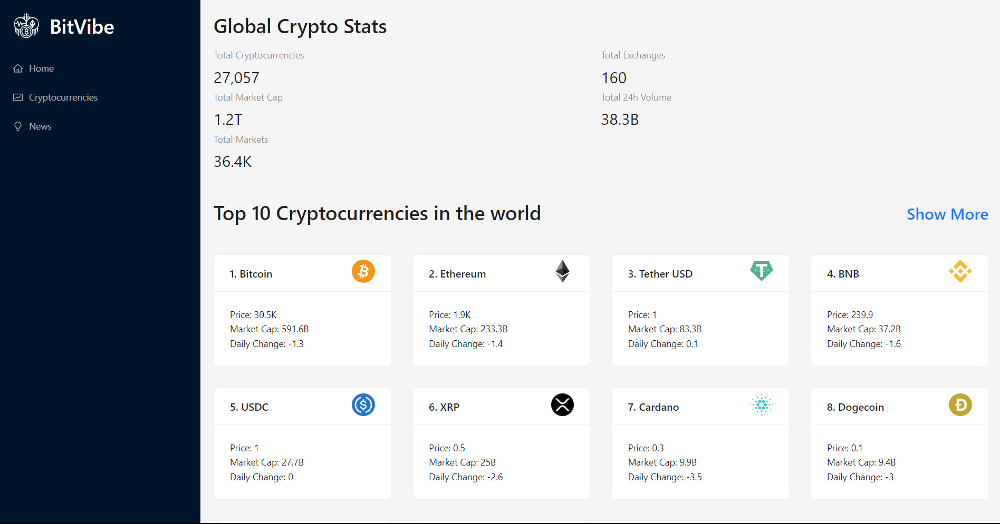
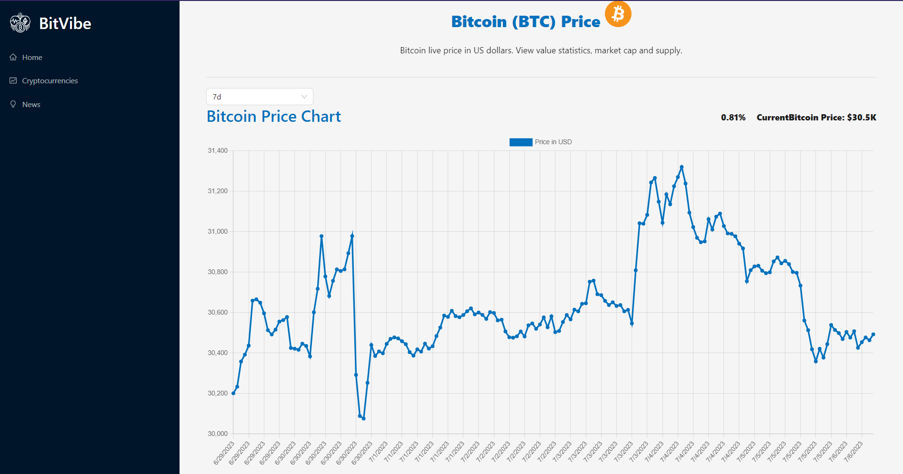
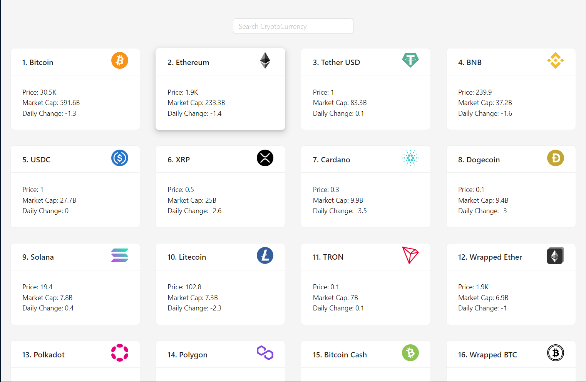

# 🚀 CryptoWebApp

CryptoWebApp is a web application that provides comprehensive information, real-time data, news, and trends about cryptocurrencies.

## ✨ Features

- 📈 View a list of various cryptocurrencies with their current prices and market data.
- 📊 Get detailed information about individual cryptocurrencies, including historical price charts, market cap, volume, and more.
- 📰 Stay updated with the latest news and trends in the cryptocurrency industry.
- ✅ Customizable watchlist to track your favorite cryptocurrencies.

## 🛠️ Technologies Used

- HTML, CSS, JavaScript
- React.js (or mention the frontend framework/library you used)
- Redux (or mention any state management tool used)
- [API Name and Version] - For fetching cryptocurrency data and news
- [Additional technologies or libraries used]

## 📚 What I Learned

During the development of this project, I gained valuable insights and acquired new skills. Here are the key takeaways:

- **Advanced React.js Concepts:** I deepened my understanding of React.js and gained hands-on experience with advanced concepts such as hooks, context API, and custom hooks. It allowed me to build the web app with more efficiency and maintainability.

- **API Integration:** I learned how to integrate external APIs to fetch real-time data and news about cryptocurrencies. Working with the [API Name] provided valuable insights into handling API requests, managing data responses, and error handling.

- **Data Visualization:** I acquired skills in data visualization by incorporating chart libraries like Chart.js. It enabled me to display cryptocurrency price histories and other relevant data in an intuitive and visually appealing manner.

- **Responsive Design:** I focused on creating a responsive design that adapts seamlessly across different devices and screen sizes. Through the use of media queries and CSS frameworks, such as Bootstrap, I learned techniques to ensure a consistent and user-friendly experience across devices.

- **Deployment:** I learned the process of deploying a React application to a web server or hosting platform like Heroku or Netlify. It involved configuring build scripts, optimizing the app for production, and handling routing in a serverless environment.

- **Challenges and Problem-solving:** Throughout the development process, I encountered challenges such as handling asynchronous actions, optimizing performance, and ensuring data consistency. By conducting thorough research, consulting documentation, and seeking help from online communities, I was able to overcome these challenges and enhance my problem-solving skills.

This project provided an opportunity for personal growth and expanding my skill set as a developer. It was a rewarding experience that deepened my understanding of frontend development, React.js, API integration, and other relevant technologies. I'm excited to continue exploring and leveraging these skills in future projects.

## ⚙️ Installation

1. 📥 Clone the repository: `git clone https://github.com/your-username/your-repo.git`
2. 📂 Navigate to the project directory: `cd CryptoWebApp`
3. 📦 Install the dependencies: `npm install`
4. 🚀 Start the development server: `npm start`
5. 🌐 Open the web app in your browser at `http://localhost:3000`

## 💡 Usage

1. 🚀 Launch the web app by following the installation instructions.
2. 🌍 Browse the list of cryptocurrencies on the homepage.
3. 🔍 Click on a specific cryptocurrency to view detailed information and price charts.
4. 📰 Access the news section to stay up-to-date with the latest happenings in the cryptocurrency world.
5. 🌟 Customize your watchlist by selecting your favorite cryptocurrencies to track.

## 📸 Screenshots

### Homepage

### Cryptocurrency Details

### News Section

### Watchlist

## 🤝 Contributing

Contributions are welcome! If you find any bugs or want to add new features, please open an issue or submit a pull request.

1. 🍴 Fork the repository
2. 🌿 Create your branch: `git checkout -b feature/your-feature`
3. 📝 Commit your changes: `git commit -m 'Add some feature'`
4. 🚀 Push to the branch: `git push origin feature/your-feature`
5. 🎉 Open a pull request

## 📄 License

[Specify the license under which your project is distributed]

## 📧 Contact

For any inquiries or support, please contact [Your Name] at [arin.agarwal02@gmail.com].
